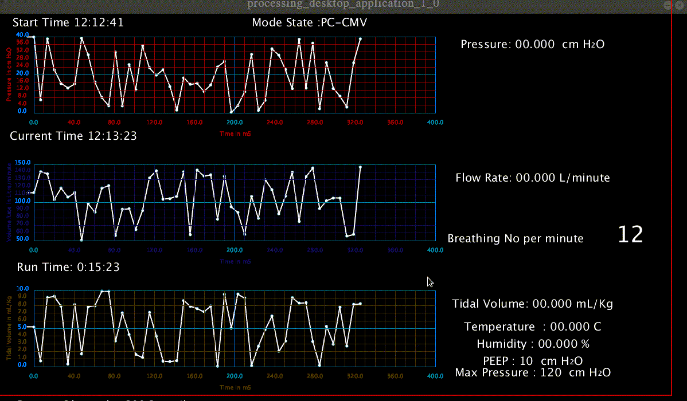

# <p style='color:blue'> OPEN SOURCE CHIP "VENTILATOR" CIRCUIT IDEA & CIRCUIT AND CODES</p>

## <p style='color:green'>Arduino-Ventilator Electtronic Configaration</p>
### <p style = 'color:magenta'> Required  electronic components :</p>

- [x] Arduino UNO R3.(1 Pice)
- [x] BME-280 Pressure Sensor Module.(3 Pieces)
- [x] 10K Potentiometer (3 Pieces)
- [x] Arduino Uno Sensor Shield.(1 Pice)
- [x] High Torqe Servo Motor.(1 Pice,May be MG-996 Servo work!)
- [x] Buzzer.(1 Piece)
- [x] Swipe Button. (1 Pice)
- [x] Jumping Wires.
- [x] Power Source.(One for Servo and other for Arduino)
- [x] Computer.


<p style='color:red'>The important message : I did not have  all items as my country is in Lockdown.So I am unable to test all the staff.If you are interested to make this then you need to your own experiment and conclusion .You may find out multiple numbers of bug in this project.I don't know.</p>

<p style = 'color:green'> Before start this applicatio I want to inform you that I commanted bme280Result() function inside of arduino code . and I also commanted this lines inside of processing code you may  need to change this lines
```pde  
//Due to absence of serial Data I am using this values
  pressureData[time] = random(40,40+ph);
 // pressureData[time] = map(pressure,0,40,40+ph,40);
<<<<<<< HEAD

  flowData[time] = random(ph+130,2*ph+130);
  //flowData[time] = map(flowRate,50,150,2*ph+85,ph+130);

  tidalVolumeData[time] = random(ph+350,2*ph+350); //The above three showing graph and values
  //tidalVolumeData[time] = map(tidalVolume,0,10,2*ph+350,ph+350);

  //The following values printing only
 // temperatureData[time] = random(15,45);//for testing purpose
  temperatureData[time] = temperature;

  //humidityData[time] = random(0,100);//for testing purpose
   humidityData[time] = humidity;

  //peepData[time] = random(0,15);//for testing purpose
  peepData[time] = peep;

 // maxPressureData[time] = random(5,15);//for testing purpose
   maxPressureData[time] = maxPressure;
```

=======
>>>>>>> cea2e1c05ec401cd5413ee12fd04350a6e3bd5a1

  flowData[time] = random(ph+130,2*ph+130);
  //flowData[time] = map(flowRate,50,150,2*ph+85,ph+130);

  tidalVolumeData[time] = random(ph+350,2*ph+350); //The above three showing graph and values
  //tidalVolumeData[time] = map(tidalVolume,0,10,2*ph+350,ph+350);

  //The following values printing only
 // temperatureData[time] = random(15,45);//for testing purpose
  temperatureData[time] = temperature;

  //humidityData[time] = random(0,100);//for testing purpose
   humidityData[time] = humidity;

  //peepData[time] = random(0,15);//for testing purpose
  peepData[time] = peep;

 // maxPressureData[time] = random(5,15);//for testing purpose
   maxPressureData[time] = maxPressure;
```


## <p style = 'color:red'>1. Why did I make this?</p>
  We all know world is going through a pandemic situation due to COVID-19.This Corona virus mainly attacking on lungs and making Pnumenia of the patient. So maximum time patient need a ventilaton support .We all know that our system have only limited number ventilator in every country.This virus transmitting very fast and getting infected more and more persion in each day.The original medical ventilator has very important and complex property and it's building time and price both are high.So we need a fast and easy  building machine which also be chip from this idea we need a chip ventilator.It may help if there has no other option.I will recomend not to use in normal situation it should use in extreem situation.

## <p style = 'color:red'> 2. What is actually have in this project ?</p>
  The basic idea of the ambu bag compress VENTILATOR is to controlled compress and release of [Ambu Bag](https://images.app.goo.gl/5exEBuaQRQ4HmXZ7A).So we need a control run of a servo motor what vexactly will do this project.

  This is not the all !  It has two mode(PC-CMV or pressure Control Mode) and (CSV-PS or Patient Controlled Mode).Which could be control by a swipe switch.
1.  * CSV-PS : We can select this mode by placing mode switch at "0".Now we need to slect number of breath per minute by breathing Pot.Now select the minimum pressure selecting by peep pot and select the maximum pressure by pressure pot.Now motor give equal number of forward and backward rotation  which is equal to breathing number per minute.

  * Another BME-280 sensor record pressure,temperature and humidity  and showing on Desktop app.
  * I am working on this :
  * <p style ='color:red'> The two BME-280 sensor measuring air flow rate and supplied tidal volume and showing on desktop application.</p>

2.  * PC-CMV : We can select this mode by placing mode switch on "1".In this mode we can't select breathing number manually.Actual Idea of this mode is The motor run forward when patient need a inspiration and run backward when patient need to expiration.

  * Another BME-280 sensor record pressure,temperature and humidity  and showing on Desktop app.
  * I am working on this :
  * <p style ='color:red'> The two BME-280 sensor measuring air flow rate and supplied tidal volume and showing on desktop application.</p>

3. I attached a Buzzer .It will make sound if there arise any kind alarming situation like,low or very  high pressure,low or very temperation,low or very high humidity,motor stopage etc.

4. Let's talk about desktop application.It is showing real time pressure,air flow rate and tidal volume data logging with graph.It is also showing some other imporatant serial data which is obtained from Arduino like breathing no,inspiration time,expiration time,temperature,humidity,runnig time etc.
<p style='color:red'>
Desktop output ,Here I did not attached any sensor altough output showing some graph as I included some random value inside of Processing code to showing.</p>


  Reference : I got inspiration to work in this kind project from here-

 * [This MIT Paper](https://web.mit.edu/2.75/projects/DMD_2010_Al_Husseini.pdf)
 * [This Instructable](https://www.instructables.com/id/COVID-19-Rapid-Manufacture-Ventilator-BVM-Ambubag-/)
 * [The ventilator graph analysis](https://youtu.be/KSd1c8koNaA)


 * ### <p style='color:green'>If you would like to use this project :</p>

 * #### Linux :
 You need arduino IDE to upload the arduino code into arduino.
   If you would like to Download this "arduino-IDE" see [this](https://www.arduino.cc/en/main/software) link.

Before install this application you need to install [Java](https://www.java.com/en/) in your computer.

Download this project file which containing the source file To run desktop application If your machine is 64 bit open Terminal and type ,except '$' :

```bash

$cd $HOME cd $HOME/Downloads/open_source_chip_arduno_ventilator_making_idea/processing_desktop_application_1_0/

```


and then run the application by following command

```bash
$./processing_desktop_application_1_0
```
If your machine is 32 bit.

 Before instaall this application you need to install [Java](https://www.java.com/en/) in your computer.
        open Terminal and type
```bash
$cd /$HOME/open_source_chip_arduno_ventilator_making_idea/processing_desktop_application_1_0/application.linux32/
```

and then

```bash
$./processing_desktop_application_1_0
```


 * #### Windows  :
 You need arduino IDE to upload the arduino code into arduino.
   If you would like to Download this "arduino-IDE" see [this](https://www.arduino.cc/en/main/software) link.

   Before instaall this application you need to install [Java](https://www.java.com/en/) in your computer.

   Download this project file which containing the source file.
   Now if your machine is 64 bit then go to downloaded folder and enter  inside of application.windows64 and double click on processing_desktop_application_1_0.exe

   Now if your machine is 32 bit then go to downloaded folder and enter  inside of application.windows 32 and double click on processing_desktop_application_1_0.exe

 * #### Mac :
 Till now I have no Idea.I will try in future to make useable in Mac.

* #### <p style='color:green'>If you would like to develop this project </p>

* Before instaall this application you need to install [Java](https://www.java.com/en/) in your computer :

* ####  Linux :

1. First, update the apt package index with:
```bash
$~ sudo apt update
```
Once the package index is updated install the default Java OpenJDK package with:
```bash
$~ sudo apt install default-jdk
```
Verify the installation, by running the following command which will print the Java version:
```bash
$~ java -version
```
Java 8 is still the most widely-used version of Java. If your application requires Java 8, you can install it by typing the following commands:
```bash
sudo apt update
sudo apt install openjdk-8-jdk
```
Installing Oracle Java

Before installing Oracle Java, make sure you read the Oracle JDK License. The license permits only non-commercial use of the software, such as personal use and development use.

Oracle Java 11 can be installed from the Linux Uprising PPA.

The following steps describe how to install Oracle Java 11 on Ubuntu 18.04:

    Install the dependencies necessary to add a new repository:
```bash
    sudo apt install software-properties-common
```
    Enable the Linux Uprising PPA by running the following commands:
```bash
    sudo add-apt-repository ppa:linuxuprising/java
```
    Once the repository is added, update the packages list and install the oracle-java11-installer package by typing:
```bash
    sudo apt update
    sudo apt install oracle-java11-installer
```
    You will be prompted to accept the Oracle license.

    Verify the installation by running the following command which will print the R version:
```bash
    java -version
```

* ####  Windows :

Please see [this](https://java.com/en/download/help/download_options.xml) link.


  * I have used "arduino-1.8.12-linux64" IDE to write Arduino Code.
    If you would like to Download this "arduino-IDE" see [this](https://www.arduino.cc/en/main/software) link.

  * I have used "processing-3.5.4-linux64" IDE to write desktop application.
    If you would like to Download "processing-IDE" see [this](https://processing.org/download/) link.
